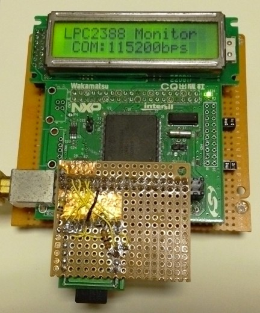
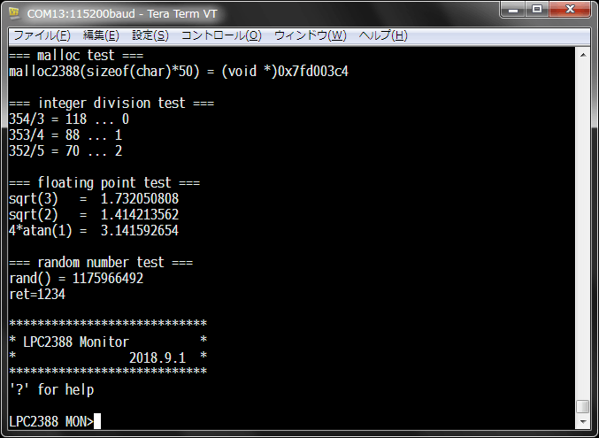

# LPC2388 Monitor/BIOS/Application SDK

## 概要

これは、NXP LPC2388 (ARM7TDMI) 用のファームウェア（モニタプログラム兼BIOS兼ランタイム）と、そのファームウェア上で動作するアプリケーションを作成するSDKです。

シリアル経由でメインRAMにユーザーアプリケーションをロードして実行する機能を持っています。ユーザーアプリケーションはメインRAM上にロードして実行されるので Flash ROMに書き込む必要がありません。

SDカードに保存されたアプリケーションをメインRAMにロードして実行する機能を持っています。また、SDカードのルートディレクトリに `AUTOEXEC.MOT` という名前のファイルを置くと、LPC2388 のリセット時に自動でロードされ実行されます。

ファームウェア（モニタプログラム）は、多くの機能をAPIとしてユーザーアプリケーションに提供します。ユーザーアプリケーションは多くの機能をAPI呼び出しで済ませることができるため、コードサイズを非常に小さくできます。

APIの中には、FatFsによるSDカードアクセス機能や、SC1602互換のキャラクタLCDを操作する機能が含まれています。

## 詳細

テキストファイル [doc/lpc2388-monbios.txt](./doc/lpc2388-monbios.txt) をご覧ください。

## ファームウェアの書き込み

ファームウェア([sdk/firmware.hex](sdk/firmware.hex))をlpcwrtでLPC2388のフラッシュに書き込む方法。

  lpcwrt.exe, lpcsp.exe, arm-none-eabi-objcopy.exe を準備。  
  CQ-FRK-NXP-ARM基板を、JP1とJP2をショートした状態で電源ON(CP2012側USBを接続)。  
  基板のJP1をオープンにすることでリセットを解除。  
  lpcwrtを起動して以下を設定：

    Configureセクション
      COM Port  : LPC2388のUART0 (CQ-FRK-NXP-ARM基板のCP2012側USB仮想COM)
      Baud Rate : 115200
      Oscillator: 12000 KHz
      control DT/RTS はチェックしない。
      lpcsp をチェックし、[Browse]ボタンで lpcsp.exe を指定
      objcopy をチェックし、[Browse]ボタンで arm-none-eabi-objcopy.exe を指定

    Flashセクション
      HEX/BIN File に firmware.hex (sdk にある)を指定

  以上を設定したら、CQ-FRK-NXP-ARM基板のJP2をOPENにして[Convert and Write]。  
  書き込みが終わったら、リセットしてTeraTerm等で接続し、プロンプト「LPC2388 MON>」が表示されれば成功。  
  起動中は、基板上のLED (Pin P1[18]) が5秒周期で点滅する。

なお、ファームウェアのソースファイルは [sdk/firmware/](sdk/firmware/) 配下にあります。ビルドするには GNU Arm Embedded Toolchain と、make や cat 等のLinuxコマンドが使える環境(Linux, MSYS, Cygwin 等)が必要です。
firmwareディレクトリ内で make を実行してください。

## アプリケーション開発方法

本ファームウェア上で動作するアプリケーションを開発する場合は [sdk/application/](sdk/application/) のサンプルプログラムにある Makefile を利用してください。
なお、Makefile の中に記述されているマクロ `PROJ_TOP_DIR` が [sdk](./sdk) ディレクトリを指している必要があります。

ビルドするには GNU Arm Embedded Toolchain と、make や cat 等のLinuxコマンドが使える環境(Linux, MSYS, Cygwin 等)が必要です。

出来あがるユーザーアプリケーションは「モトローラSフォーマット」のファイルです（拡張子が `.mot`）。このファイルの中身をシリアル接続されたターミナルのコンソールから `load` コマンドでロードするか、このファイルをSDカードに入れて `exec` コマンドで実行してください。

## 謝辞：

このモニタプログラムはbitcraftさんの [LPC2388_gccmon.lzh](http://bitcraft.web.fc2.com/embedded/arm7/armlpc2388.html) をベースにさせていただきました。

上記プログラムに、以下の方々のプログラムを追加したり、コードをコピーして使わせていただいています。

  [中村晋一郎さん]( https://www.cubeatsystems.com/ntshell/ )  
  [ねむいさん]( http://nemuisan.blog.bai.ne.jp/?eid=155799 )  
  [ChaNさん]( http://elm-chan.org/fsw.html )  
  [宮前さん]( http://miyakeng.web.fc2.com/arm/arm.htm )  
  [Sakazumeさん]( http://219.117.208.26/~saka/ham/LCD2/ )  

また、以下の方々の情報を参考にさせていただきました。

  [がた老さん]( http://gataro-avr-ken.cocolog-nifty.com )  
  [irukaさん]( https://github.com/iruka-/ATMEL_AVR/blob/master/md/ARM.md )  
  [SYSLAB blogさん]( http://syslab.asablo.jp/blog/ )  
  [秋田純一さん]( http://akita11.jp/diary/archives/2007/11/arm7.html )  
  [HRA!さん]( http://www5d.biglobe.ne.jp/~hra/note/arm/index.htm )  

---
kitanokitsune / 北乃きつね
